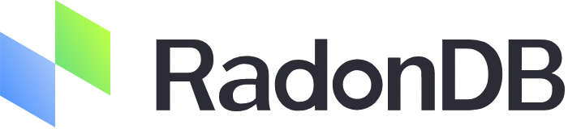
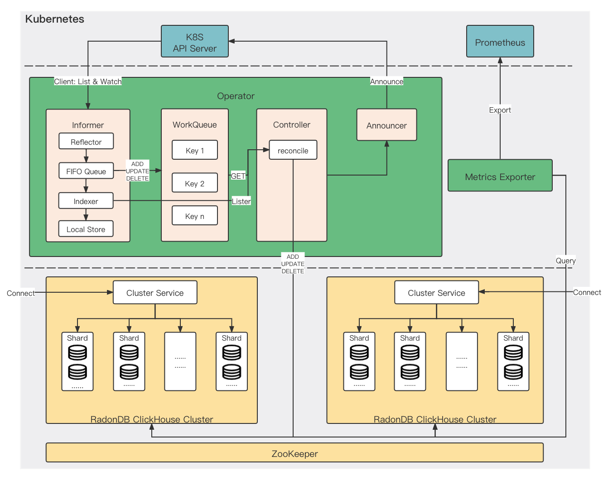

# 

> English | [简体中文](README_zh.md)

## What is RadonDB ClickHouse

ClickHouse is a column-oriented database management system (DBMS) for online analytical processing of queries (OLAP).

RadonDB ClickHouse is an open-source, cloud-native, highly availability cluster solutions based on [ClickHouse](https://clickhouse.tech/) and [ClickHouse Operator](https://github.com/Altinity/clickhouse-operator). 

[RadonDB ClickHouse Operator](https://github.com/radondb/radondb-clickhouse-operator) is committed to creating ClickHouse clusters on Kubernetes quickly and easily. RadonDB ClickHouse Operator supports [Kubernetes 1.15.11+](https://kubernetes.io), [KubeSphere 3.1.x](https://kubesphere.com.cn), [Rancher](https://rancher.com/), [OpenShift](https://www.redhat.com/en) and other container platforms to deploy, configure and manage RadonDB ClickHouse clusters.

## Architecture

## Main Features

The RadonDB ClickHouse Operator for Kubernetes currently provides the following:

- ClickHouse configuration and settings (including Zookeeper integration)
- ClickHouse cluster scaling including automatic schema propagation
- ClickHouse version upgrades
- Exporting ClickHouse metrics to Prometheus
- Multiple customization and custom configuration templates available

  - Creates ClickHouse clusters based on Custom Resource [specification](docs/chi-examples/99-clickhouseinstallation-max.yaml) provided
  - Customized storage provisioning (VolumeClaim templates)
  - Customized pod templates
  - Customized service templates for endpoints
  - Flexible templating

## Quick Start

> On Kubernetes, we recommend you to install ClickHouse cluster through RadonDB ClickHouse Operator.

- [Quick Start](docs/quick_start.md)
- [Installing RadonDB ClickHouse on KubeSphere](docs/en-us/deploy_radondb-clickhouse_with_operator_on_kubesphere_appstore.md)
- [More Detailed Guidance](docs/README.md)

## License

RadonDB ClickHouse Operator is published under the Apache License 2.0.

See [LICENSE](./LICENSE) for more details.

## Discussion and Community

- Contribution

  We welcome any kind of code contribution, some PR requirements can be found in [How to contribute/submit a patch](./CONTRIBUTING.md).

- Forum

    The RadonDB ClickHouse topic is in [KubeSphere Community](https://kubesphere.com.cn/forum/t/radondb).

- Please pay attention to our official account.

  

---

  
Please submit any RadonDB ClickHouse Operator bugs, issues, and feature requests to RadonDB MySQL GitHub Issue.
 
</a>

