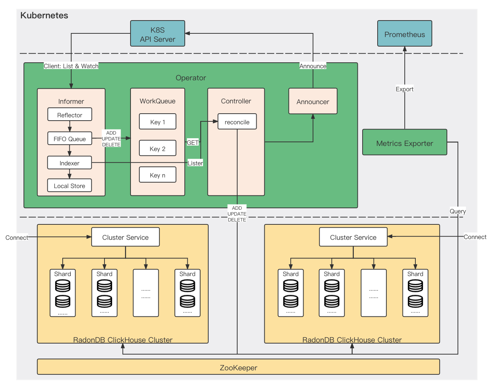

# 

> [English](README.md) | 简体中文

----

## 什么是 RadonDB ClickHouse

ClickHouse 是一个用于联机分析(OLAP)的列式数据库管理系统(DBMS)。

RadonDB ClickHouse 是一款基于 [ClickHouse](https://clickhouse.tech/) 和 [ClickHouse Operator](https://github.com/Altinity/clickhouse-operator) 的开源、高可用、云原生集群解决方案。[RadonDB ClickHouse Operator](https://github.com/radondb/radondb-clickhouse-operator) 致力于在 Kubernetes 上轻便快速创建 ClickHouse 集群。

RadonDB ClickHouse Operator 支持在 [Kubernetes 1.15.11+](https://kubernetes.io) 、[KubeSphere 3.1.x](https://kubesphere.com.cn) 、[Rancher](https://rancher.com/) 、[OpenShift](https://www.redhat.com/en) 等容器平台部署、配置和管理 RadonDB ClickHouse 集群。

## 架构图

## 特性功能

- 兼容 ClickHouse 配置，集成 ZooKeeper 组件
- 支持集群自动扩容
- 支持 ClickHouse 内核版本升级
- 满足 Prometheus 监控指标标准，支持第三方平台监控服务
- 提供多种定制和自定义配置模版
  
  - 定制的资源配置模版
  - 定制的存储配置（VolumeClaim）模版
  - 定制的 Pod 配置模版
  - 定制的终端服务配置模版
  - 灵活的自定义配置模版
  
## 快速入门

> 当使用 Kubernetes 时，推荐您通过 RadonDB ClickHouse Operator 部署 ClickHouse 集群。

- [快速入门](docs/zh-cn/quick_start.md)
- [在 KubeSphere 上部署 RadonDB ClickHouse](docs/zh-cn/deploy_radondb-clickhouse_with_operator_on_kubesphere_appstore.md)
- [更多文档](docs/README.md)

## 协议

RadonDB ClickHouse 基于 Apache 2.0 协议，详见 [LICENSE](./LICENSE)。

## 欢迎加入社区话题互动

- 贡献

  我们欢迎任何形式代码贡献，一些提交 PR 要求请参见 [How to contribute/submit a patch](./CONTRIBUTING.md)。

- 论坛

  请加入[KubeSphere 开发者社区](https://kubesphere.com.cn/forum/t/radondb) RadonDB ClickHouse 话题专区。

- 欢迎关注微信公众号

  

  
如有任何关于 RadonDB ClickHouse Operator 的问题或建议，请在 GitHub 提交 Issue 反馈。
 
</a>

