Contents
=================

- [Contents](#contents)
- [Deploy Radondb ClickHouse On KubeSphere](#deploy-radondb-clickhouse-on-kubesphere)
  - [Introduction](#introduction)
  - [Prerequisites](#prerequisites)
  - [Procedure](#procedure)
    - [Step 1 : Deploy ClickHouse Operator](#step-1--deploy-clickhouse-operator)
    - [Step 2 :  Add an app repository](#step-2---add-an-app-repository)
    - [Step 3 :  Deploy a ClickHouse Cluster](#step-3---deploy-a-clickhouse-cluster)
    - [Step 4 :  Verification](#step-4---verification)
  - [Access RadonDB ClickHouse](#access-radondb-clickhouse)

# Deploy Radondb ClickHouse On KubeSphere

> English | [简体中文](../zh-cn/deploy_radondb-clickhouse_with_operator_on_kubesphere_appstore.md)

## Introduction

RadonDB ClickHouse is an open-source, cloud-native, highly availability cluster solutions based on [ClickHouse](https://clickhouse.tech/) and [RadonDB ClickHouse Operator](https://github.com/radondb/radondb-clickhouse-operator). It provides features such as high availability, PB storage, real-time analytical, architectural stability and scalability.

This tutorial demonstrates how to deploy ClickHouse Operator and a ClickHouse Cluster on KubeSphere.

## Prerequisites

- You have created a KubeSphere Cluster.
- You need to enable [the OpenPitrix system](https://kubesphere.io/docs/pluggable-components/app-store/) in KubeSphere.
- You need to [Create Workspaces, Projects, Accounts and Roles](https://kubesphere.io/docs/quick-start/create-workspace-and-project/) in KubeSphere.
- You need to enable the gateway in your project to provide [external access](https://kubesphere.io/docs/project-administration/project-gateway/).

## Procedure

### Step 1 : Deploy ClickHouse Operator

Log in to the KubeSphere Web console, and use **Kubectl** from the **Toolbox** in the bottom-right corner to run the following command to install ClickHouse Operator. It is recommended that you have at least two worker nodes available in your cluster.

```bash
kubectl apply -f https://raw.githubusercontent.com/radondb/radondb-clickhouse-operator/master/deploy/operator/clickhouse-operator-install-bundle.yaml
```

> **Notice**
> 
> This command will install ClickHouse Operator in the namespace `kube-system`. Therefore, ClickHouse Operator only needs to be installed once in a KubeSphere cluster.

```bash
$ kubectl apply -f https://raw.githubusercontent.com/radondb/radondb-clickhouse-operator/master/deploy/operator/clickhouse-operator-install-bundle.yaml
customresourcedefinition.apiextensions.k8s.io/clickhouseinstallations.clickhouse.radondb.com configured
customresourcedefinition.apiextensions.k8s.io/clickhouseinstallationtemplates.clickhouse.radondb.com configured
customresourcedefinition.apiextensions.k8s.io/clickhouseoperatorconfigurations.clickhouse.radondb.com configured
serviceaccount/clickhouse-operator created
clusterrole.rbac.authorization.k8s.io/clickhouse-operator-kube-system unchanged
clusterrolebinding.rbac.authorization.k8s.io/clickhouse-operator-kube-system unchanged
configmap/etc-clickhouse-operator-files created
configmap/etc-clickhouse-operator-confd-files created
configmap/etc-clickhouse-operator-configd-files created
configmap/etc-clickhouse-operator-templatesd-files created
configmap/etc-clickhouse-operator-usersd-files created
deployment.apps/clickhouse-operator created
service/clickhouse-operator-metrics created
```

### Step 2 :  Add an app repository

1. In `demo-workspace`, go to **App Repositories** under **App Management**, and then click **Add**.

   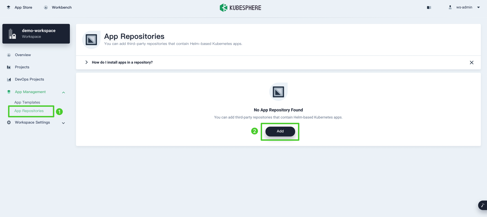

2. In the dialog that appears, enter `clickhouse` for the app repository name and `https://radondb.github.io/radondb-clickhouse-operator/` for the repository URL. Click **Validate** to verify the URL and you will see a green check mark next to the URL if it is available. Click **OK** to continue.

3. Your repository displays in the list after successfully imported to KubeSphere.

### Step 3 :  Deploy a ClickHouse Cluster

1. In `demo-project`, go to **Apps** under **Application Workloads** and click **Deploy New App**.

   

2. In the dialog that appears, select **From App Templates**.

   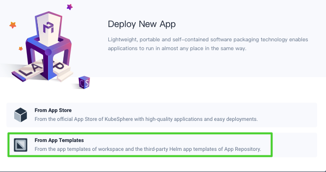

3. On the new page that appears, select **clickhouse** from the drop-down list and then click **clickhouse-cluster**.

   

4. On the **Chart Files** tab, you can view the configuration and download the `values.yaml` file. Click **Deploy** to continue.

   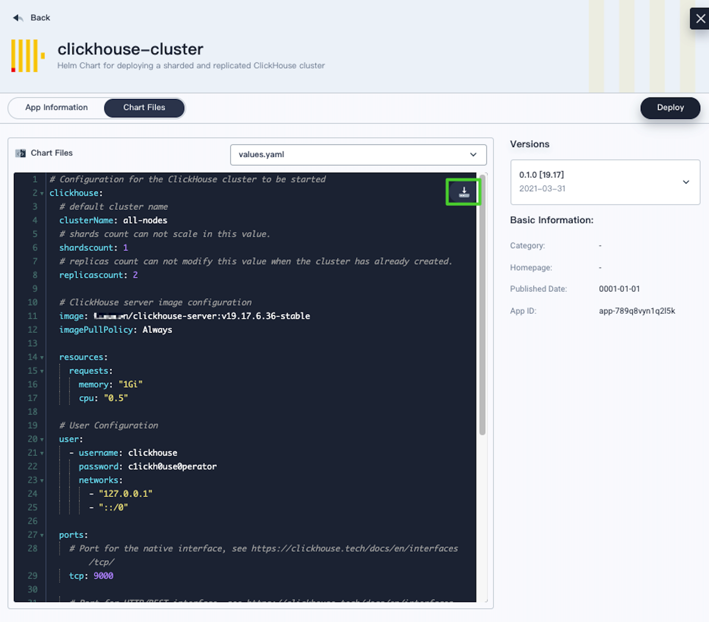

5. On the **Basic Information** page, confirm the app name, app version, and deployment location. Click **Next** to continue.

   

6. On the **App Configurations** tab, you can change the YAML file to customize configurations. In this tutorial, click **Deploy** to use the default configurations.

   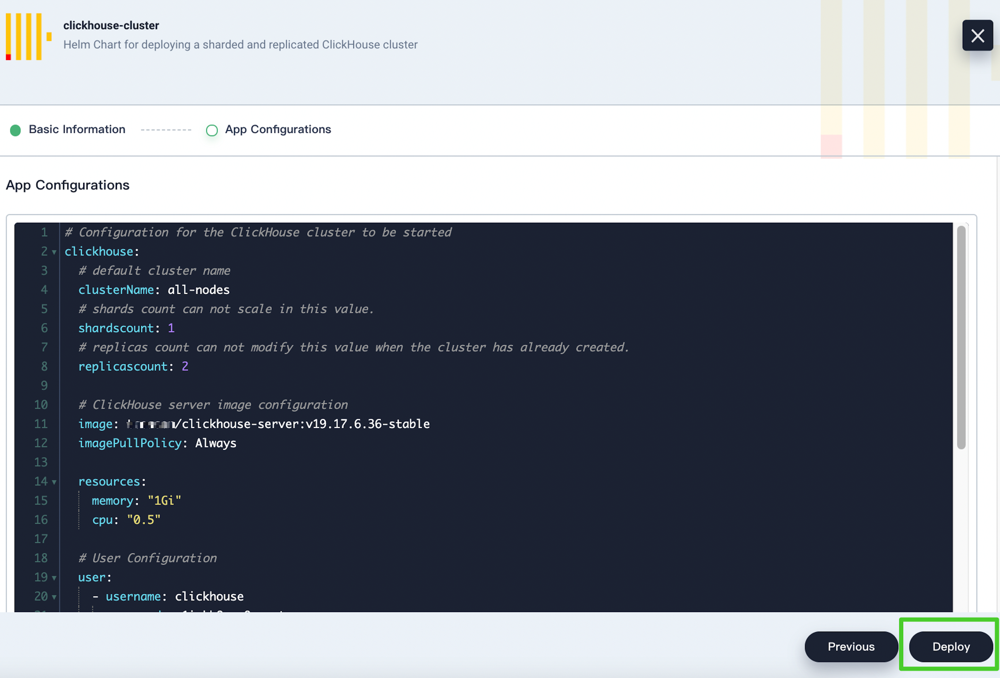

7. After a while, you can see the app status shown as **Running**.

   

### Step 4 :  Verification

1. In **Workloads** under **Application Workloads**, click the **StatefulSets** tab and you can see the StatefulSets are up and running.

   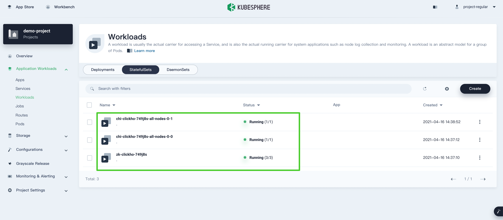

3. Click a single StatefulSet to go to its detail page. You can see the metrics in line charts over a period of time under the **Monitoring** tab.

   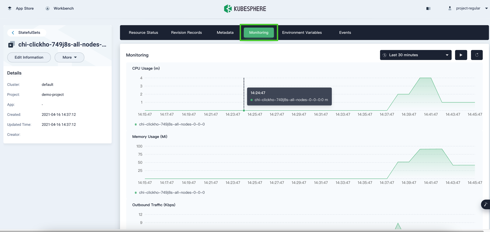

3. In **Pods** under **Application Workloads**, you can see all the Pods are up and running.

   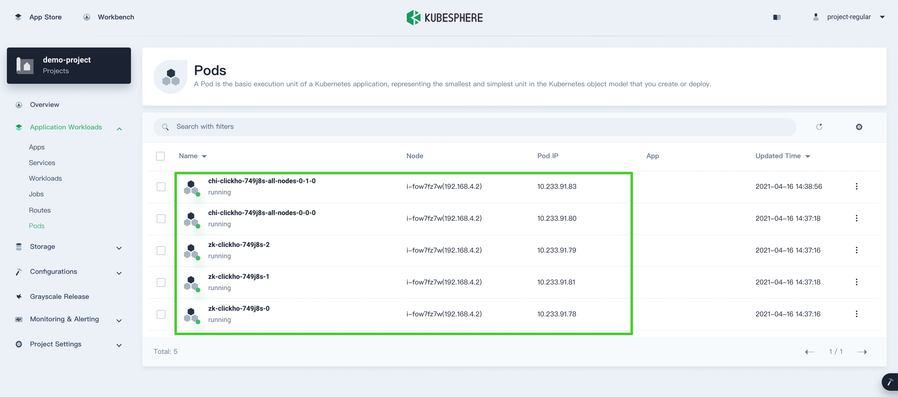

4. In **Volumes** under **Storage**, you can see the ClickHouse Cluster components are using persistent volumes.

   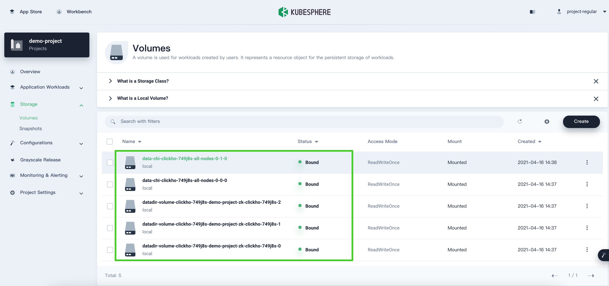

5. Volume usage is also monitored. Click a volume item to go to its detail page. Here is an example of one of the data nodes.

   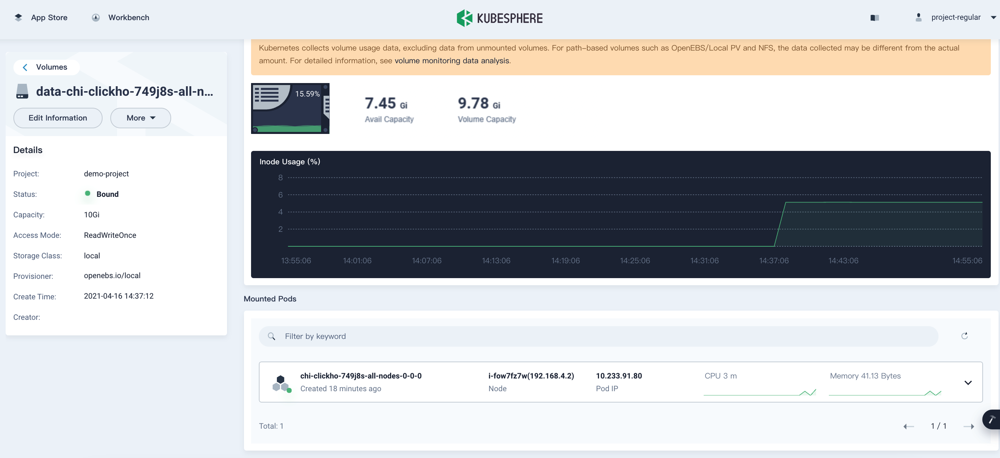

6. On the **Overview** page of the project, you can see a list of resource usage in the current project.

   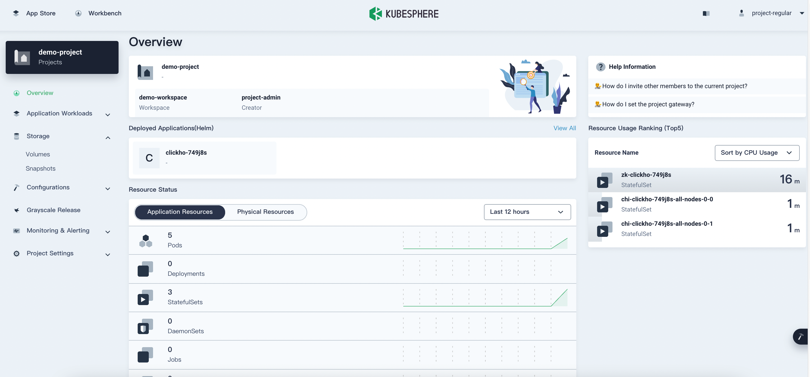

## Access RadonDB ClickHouse

1. Hover your cursor over the hammer icon in the bottom-right corner and then select **Kubectl**.

2. In the window that appears, run the following command and then navigate to the username and password of the ClickHouse cluster.

   ```bash
   kubectl edit chi clickho-749j8s -n demo-project
   ```

   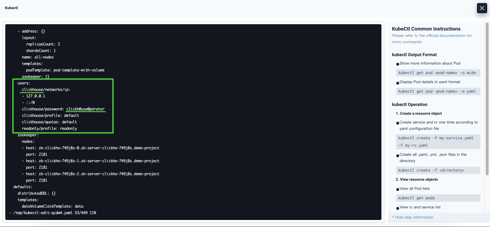

   > **Notice**
   > 
   > In the above command, `clickho-749j8s` is the ClickHouse application name and `demo-project` is the project name. Make sure you use your own application name and project name.

3. Run the following command to access the ClickHouse cluster, and then you can use command like `show databases` to interact with it.

   ```bash
   kubectl exec -it chi-clickho-749j8s-all-nodes-0-0-0 -n demo-project -- clickhouse-client --user=clickhouse --password=c1ickh0use0perator
   ```

   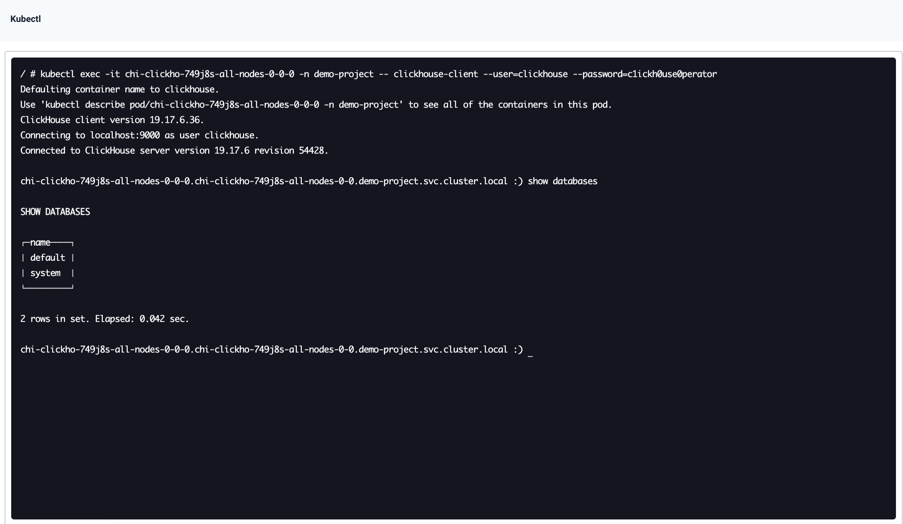

> **Notice**
> 
> In the above command, `chi-clickho-749j8s-all-nodes-0-0-0` is the Pod name and you can find it in **Pods** under **Application Workloads**. Make sure you use your own Pod name, project name, username and password.
